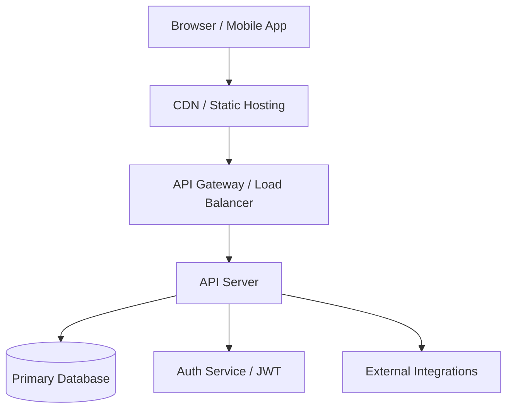

# Architecture — [Project Name]

## System Overview

<!-- Replace with Mermaid diagram reflecting the actual system -->

## Components

| Component       | Technology | Responsibility                      | Local port |
|-----------------|------------|-------------------------------------|------------|
| API Server      |            |                                     | 8080       |
| Frontend SPA    | React 18   | User interface                      | 5173       |
| Database        |            | Persistent storage                  | 5432       |
| Auth            |            | Authentication & token management   |            |
| Cache           |            | Session / query caching             | 6379       |

## Data Flows

### Authentication
1. User submits credentials → `POST /api/v1/auth/login`
2. API validates → returns access token (15 min) + sets refresh token cookie (httpOnly, 7 days)
3. Frontend stores access token in memory only
4. On expiry → silent refresh via `POST /api/v1/auth/refresh`
5. Logout → `POST /api/v1/auth/logout` → revokes refresh token

### [Key Business Flow 1 — name it]
<!-- Step-by-step. Include which service, endpoint, and data store is touched at each step. -->

### [Key Business Flow 2 — name it]
<!-- Step-by-step -->

## External Integrations

| Service | Purpose | Auth method | Rate limit | Timeout |
|---------|---------|-------------|------------|---------|
|         |         |             |            |         |

## Key Design Decisions

| Decision | Choice made | Reason / trade-off |
|----------|-------------|-------------------|
| Auth strategy | JWT stateless | Horizontal scaling without shared session store |
|  |  |  |

## Platform Runtime Constraints

> Completed by the solution-architect before development starts.
> Every planned library and capability must be verified against the target deployment runtime.
> Discovering incompatibilities at deployment time causes costly rework — catch them here.

### Target Runtime

- **Frontend:** <!-- Vercel (Node.js runtime / Edge runtime) / Cloudflare Pages -->
- **Backend / API:** <!-- Cloudflare Workers (V8 isolate) / Vercel Edge / AWS Lambda / Cloud Run -->

### Known Runtime Limitations

<!-- List the key constraints of the chosen runtime. Examples for Cloudflare Workers:
- No native Node.js modules (no `fs`, `path`, `child_process`)
- No native addons / N-API (bcrypt, sharp, etc. will not work)
- `crypto`: use Web Crypto API (`crypto.subtle`) — not Node's `crypto`
- No TCP connections (use Cloudflare Hyperdrive or REST APIs for DB access)
- CPU time limit per request (check plan limits)
- Script size limit: 1MB compressed
-->

### Platform Runtime Compatibility Matrix

| Library / Capability | Required by | Works in runtime? | Alternative if not |
|---|---|---|---|
| <!-- e.g. bcrypt --> | <!-- Auth - password hashing --> | <!-- ❌ No --> | <!-- bcryptjs / Web Crypto API --> |
| <!-- e.g. Node crypto --> | <!-- Token generation --> | <!-- ⚠️ Partial --> | <!-- Web Crypto API (crypto.subtle) --> |
| <!-- Add all planned libraries --> | | | |

**Sign-off:** <!-- Architect name + date — development must not start until this is signed -->

## Constraints & Known Limitations

<!-- Decisions forced by client, budget, timeline, or legacy systems.
     Helps Claude avoid re-debating settled choices. -->
