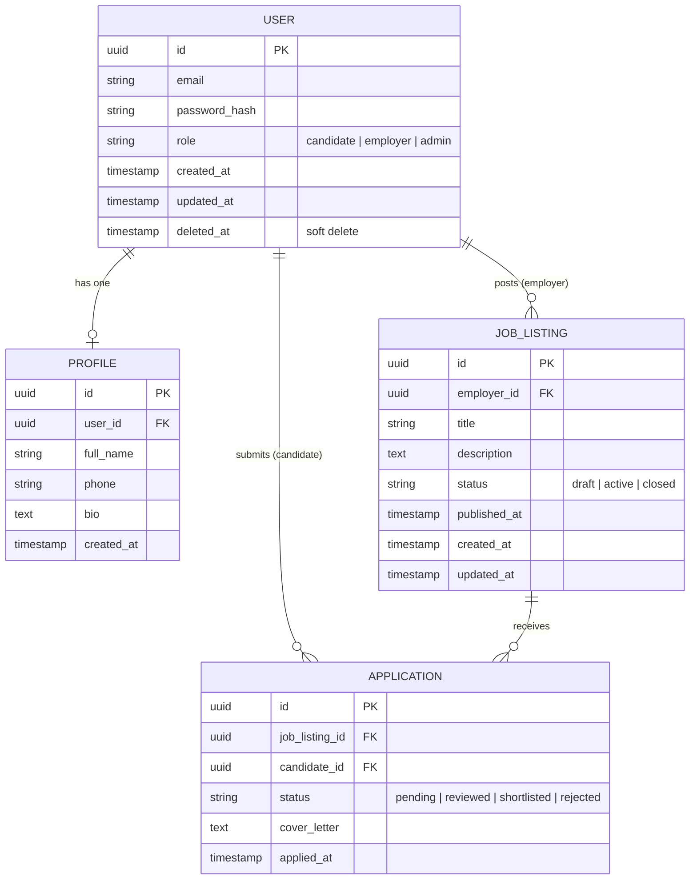

# ER Diagram — [Project Name]

> Produced by the `solution-architect` agent. **Do not edit manually** — update via the architect.
> This is a mandatory deliverable before development starts.
> Full database schema in Mermaid `erDiagram` format.

<!-- last-updated: YYYY-MM-DD -->

## Entity-Relationship Diagram

## Entity Descriptions

| Entity | Description | Key Business Rules |
|---|---|---|
| `USER` | All system users (candidates, employers, admins) | Role determines access level; soft-delete only |
| `PROFILE` | Extended profile info for a user | One-to-one with USER |
| `JOB_LISTING` | A job posted by an employer | Only `active` listings are visible to candidates |
| `APPLICATION` | A candidate's application to a job listing | One candidate can apply to one listing only once |

## Indexes

| Table | Index | Columns | Reason |
|---|---|---|---|
| `user` | `idx_user_email` | `email` | Login lookup |
| `job_listing` | `idx_job_status` | `status, published_at` | Feed queries |
| `application` | `idx_app_candidate_job` | `candidate_id, job_listing_id` | Unique constraint + lookup |

## Notes

<!-- Any constraints, migration considerations, or design decisions not obvious from the diagram -->
